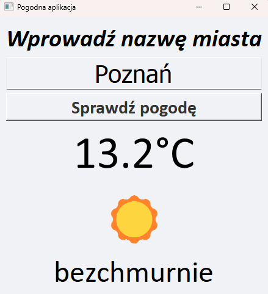
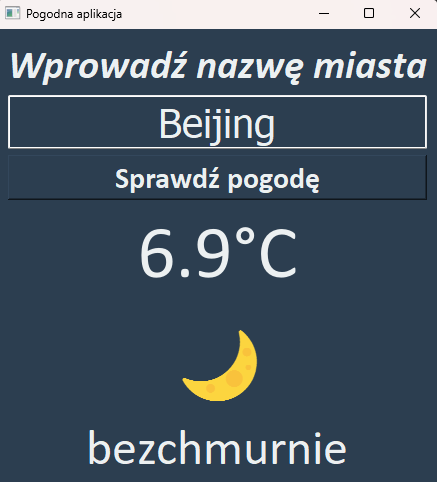

  
  
  

 

  <h1>🌦️ WeatherApp</h1>
  
<strong>A desktop application with real-time weather tracking and automatic theme adaptation.</strong>

---

### 📝 Overview
**WeatherApp** is a lightweight desktop utility built with **Python** and **PyQt5**. It fetches live weather data from the OpenWeatherMap API, providing users with instant updates on temperature and atmospheric conditions for any city worldwide.

The standout feature of this app is its **Context-Aware UI**. It calculates the sunrise and sunset times for the searched location to automatically toggle between **Light** and **Dark** themes, ensuring a comfortable user experience regardless of the time of day.

---

### ✨ Key Features
* 🌍 **Global Search** – Access weather data for any city by its name.
* 🌓 **Dynamic Theming** – Interface colors change based on the local time of the searched city.
* 🛡️ **Advanced Error Handling** – Uses Python's modern `match-case` syntax to handle API errors (404, 500, etc.) and connection issues gracefully.
* 🎨 **Clean UI/UX** – Features a responsive layout, Calibri typography, and high-quality Emoji indicators.
* 🇵🇱 **Localized Content** – Weather descriptions are automatically mapped to Polish for better local readability.

---

### 📸 Preview

  <table style="border: none;">
    <tr>
      <td align="center"><strong>Day Mode (Poznań)</strong></td>
      <td align="center"><strong>Night Mode (Beijing)</strong></td>
    </tr>
    <tr>
      <td></td>
      <td></td>
    </tr>
  </table>

---

### 🛠️ Tech Stack
* **Language:** Python 3.10+
* **GUI Framework:** PyQt5
* **API:** OpenWeatherMap API
* **Networking:** Requests library

---

  Developed with ❤️ by Bartix117

